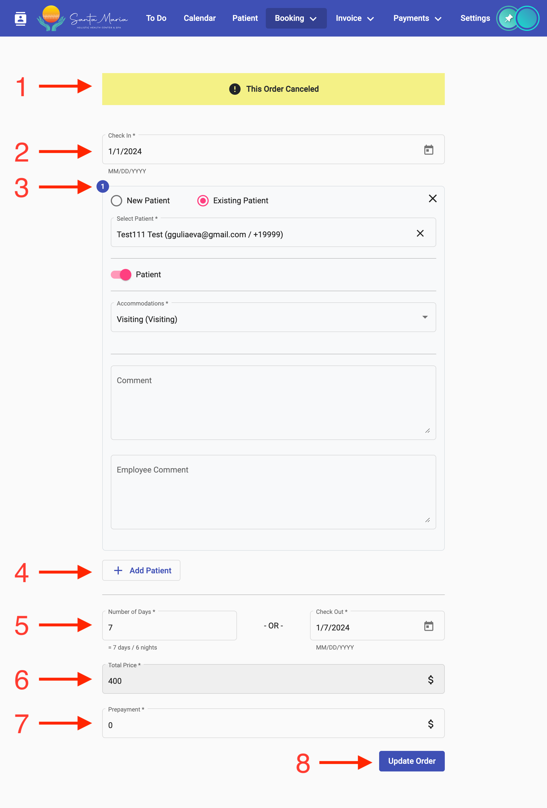

# Editing a booking

There are two ways to access the editing of a booking:

1. On the page displaying all bookings, expand the desired booking and click the "Edit Booking" button in the bottom right corner of the expanded card.
2. On the client's page, open the list of the client's bookings, and on the card of the desired booking, click the "Edit Booking" button.

The booking editing page looks similar to the booking creation page:

<figure><figcaption></figcaption></figure>

In the image:

1 — Warning about the booking status.

2 — Check-in date.

3 — Client form (similar to the client form when creating a new booking). When editing a booking, all clients are loaded as existing clients.

4 — Add client to the booking button.

5 — Information about the number of days and check-out date.

6 — Total price of the booking.

7 — Prepayment.

8 — Save changes button.

If changes are made to an expired booking, a warning may appear regarding the reserved room. If the room is occupied, it will not be possible to save the booking without changing the room.
