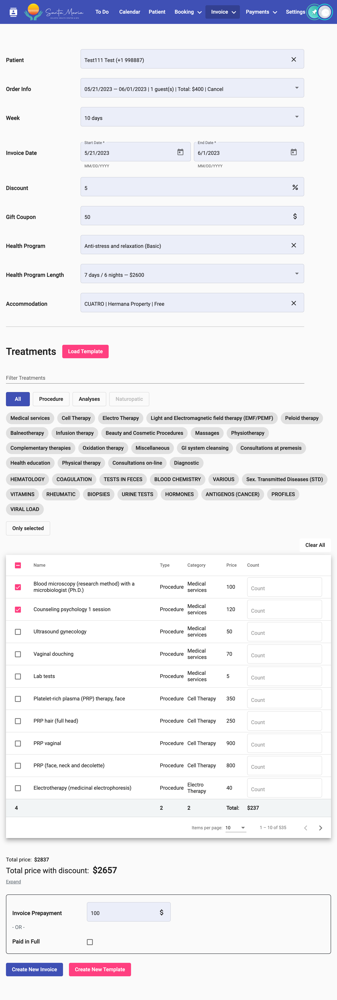

# Creating a new invoice

To create a new invoice, go to the "Invoice" ➡️ "Create New" item in the main menu.

The form for adding a new invoice is visually divided into three parts:

1. Inputting general invoice data - assigning the invoice to a client, specifying the dates, adding discounts, including wellness programs and accommodation in the invoice.
2. Adding services to the invoice (excluding wellness programs and accommodation).
3. Total amount for the invoice and inputting the payment made for the invoice.

Let's examine each part in more detail.

<figure><figcaption></figcaption></figure>

In the image, the input of general invoice data:

1 — Selecting the client to whom the invoice should be added. When clicking on the input field, a list of all patients appears. It is not enough to simply input the client's data; you need to select the client from the list for correct addition. This field is mandatory.

After selecting the client, if the client has bookings, a field for selecting a booking appears:

<figure><figcaption></figcaption></figure>

This field is optional. After selecting a booking, the dates for which the invoice is being created are automatically filled (they can be manually changed).

2 — "Week" - selecting a conditional period for which the invoice is being created. This field is optional. It does not affect anything and serves as a visual aid when working with the invoice list. The available values are: 3 days, 10 days, 1 week, 2 weeks, ..., 8 weeks.

3 — Period for which the invoice is being created. If no booking is selected, the data in this field is manually entered. This field is mandatory.

4 — Discount in percentage. The percentage is applied only to a specific list of services. The default is 0%.

5 — Gift voucher amount in dollars / discount in dollars. The default is $0.

6 — Wellness program. This field is optional. When clicking on the field, a list of available programs is displayed. After selecting a program, a new field for selecting a package appears:

<figure><figcaption></figcaption></figure>

When selecting a wellness program, selecting a package is mandatory.

7 — Adding accommodation payment to the invoice. This field is optional. When clicking on the field, a list of available rooms is also displayed.

8 — Field for entering gratuity in percent. Gratuity are calculated from the total amount with all discounts.

The next section when creating a new invoice is adding services to the invoice. The service addition field looks as follows:

<figure><figcaption></figcaption></figure>

1 — Field/section name.

2 — Button to upload a service list template.

3 — Service search/filtering field: search is performed across all columns of the list.

4 — Selecting the service type: all, procedures, analyses, or naturopathy. The "Naturopathy" service type becomes available only after selecting a procedure that includes a naturopathic protocol.

5 — Selecting the service category.

6 — Enabling/disabling the view of only selected services.

7 — Button to clear the selection of services.

8 — List of all services in a table format.

9 — The first column of the table is a checkbox to select a service.

10 — The last column of the table is for adding the quantity of the selected service to the invoice (by default, a service is added in a single instance).

11 — Total number of selected services.

12 — Total number of selected service types.

13 — Total number of selected service categories.

14 — Total cost of services in the invoice.

15 — Navigation panel for the table pages.

The next part of the invoice is the information about the payment amount received and the payment confirmation input fields:

<figure><figcaption></figcaption></figure>

In the image:

1 — Field for deducting the client's bonus points. This field is available only if the client has bonuses eligible for deduction.

2 — Total cost of the invoice.

3 — Invoice cost with applied discounts.

4 — Amount of gratuity in dollars.&#x20;

5 — The cost of the invoice with a gratuity.

4 — Field to input the advance payment made

5 — Field for confirming that the invoice has been fully paid.

If data is added to the invoice, this part will appear as follows:

<figure><figcaption></figcaption></figure>

1 — Field for viewing how the discounted amount is calculated. If you click on "Expand," you can see, for example, the following:

<figure><figcaption></figcaption></figure>

2 — The button to create a new invoice is only available when the minimum amount of data is filled in (wellness program or accommodation or at least one service).

3 — The button to create a new service template. It is only available when at least one service is selected from the list.

Immediately after saving the invoice, a new window opens with the generated invoice for printing.

Example of an invoice creation page with filled fields:

<figure><figcaption></figcaption></figure>
