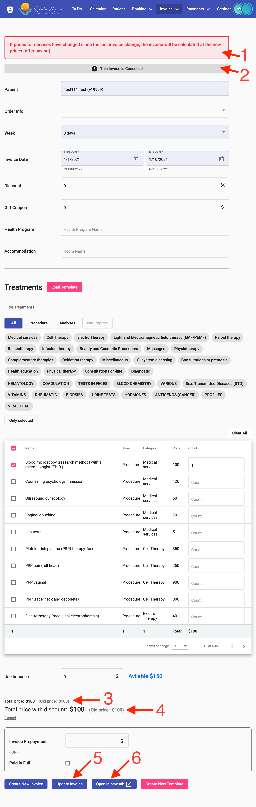

# Редактирование инвойса

Чтобы открыть инвойс для редактирования, необходимо нажать на кнопку "Редактировать" рядом с инвойсом на странице клиента или на странице со списком инвойсов.

Прежде чем откроется страница редактирования, появится предупреждение: "Если цены на услуги изменились с момента последнего изменения инвойса, то инвойс будет пересчитан по новым ценам (после сохранения). Вы уверены, что хотите внести изменения в инвойс?"&#x20;

<figure><figcaption></figcaption></figure>

Только после подтверждения откроется страница для редактирования инвойса.

Страница редактирования инвойса аналогична странице создания инвойса за некоторым исключением:

<figure><figcaption></figcaption></figure>

1 — Предупреждение о возможном изменении цен.

2 — Статус инвойса.

3 — Старая цена инвойса без скидок.

4 — Старая цена инвойса со скидками.

5 — Кнопка "Сохранить изменения".

6 — Кнопка "Открыть инвойс отдельно в новом окне".

На изображении видно, что кнопка создать инвойс остаётся доступной, поэтому при необходимости, инвойс можно повторить, внеся незначительные изменения.

