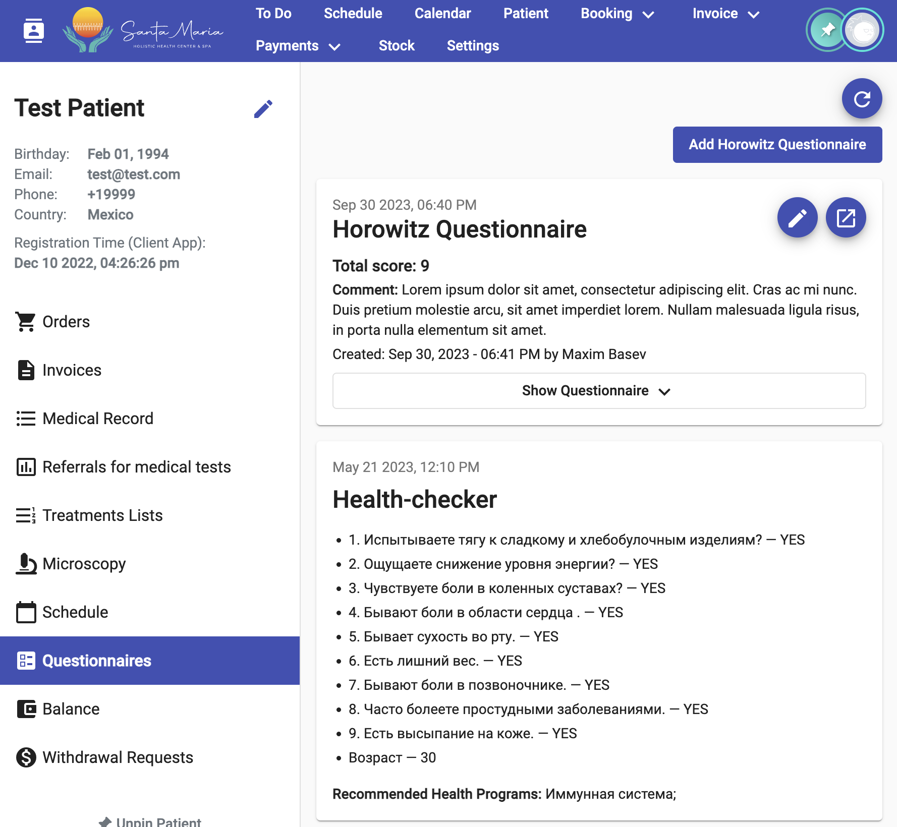

# Questionnaires

Questionnaires are divided into two types:

* Advertising Questionnaires are Questionnaires that patients complete independently without logging into their personal account. In this case, the survey is "linked" to the patient via email. If the user's email in the system is incorrect or is specified for multiple clients, the survey may be linked to the wrong client. These surveys cannot be canceled or changed.
* General Questionnaires are filled out by the doctor independently from the Dashboard system.

The Questionnaires section on the patient's page looks as follows:

<figure><figcaption></figcaption></figure>

In the image:

* In the top right corner, there is a "Refresh Page Information" button. If new surveys appear for the patient after opening this section, they will appear after clicking this button.
* Below that, there is an "Add Horowitz Questionnaire" button.
* Next, there is a list of the patient's questionnaires: first, there are cards with questionnaires results filled out by the doctor, followed by advertising questionnaires.

The cards with results from different questionnaires look different.

The questionnaires creation/editing page created by the doctor in the Dashboard system will look as follows:

<figure><figcaption></figcaption></figure>
