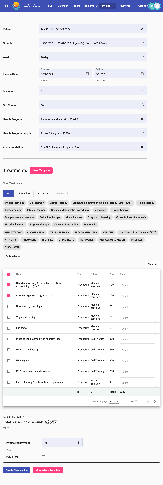

# Создание нового инвойса

Чтобы создать новый инвойс, необходимо перейти из главного меню в пункт "Инвойс" ➡️ "Создать новый".

Форма добавления новоего инвойса визуально поделена на три части:

1. Ввод общих данных по инвойсу — какому клиенту назначен инвойс, на какие числа, добавление скидок, добавление к инвойсу оздоровительных программ и проживания.
2. Добавление услуг в инвойс (не включая оздоровительных программ и оплату проживания).&#x20;
3. Итоговая сумма по инвойсу и добавление произведённой по инвойсу оплаты.

Рассмотрим каждую часть подробнее.

<figure><figcaption></figcaption></figure>

На изображении ввод общих данных по инвойсу:

1 — Выбор клиента, которому необходимо добавить инвойс. При нажатии на поле и ввода данных, появляется список всех пациентов. Для корректного добавления недостаточно просто ввести данные клиента, необходимо выбрать клиента из списка. Данное поле обязательно для заполнения.

После выбора клиента, если у клиента есть бронирования, появляется поле выбора бронирования:

<figure><figcaption></figcaption></figure>

Данное полe не обязательное для заполнения. После выбора бронирования, даты, на которое оформляется инвойс, заполнятся автоматически (их можно изменить вручную).

2 — "Неделя" — выбор условного периода, на который оформляется инвойс. Необязательное поле. Данное поле ни на что не влияет, и является визуальным помощником при работе со списком инвойсов. Доступны значения: 3 дня, 10 дней, 1 неделя, 2 недели, ...,  8 недель.

3 — Период, на который оформляется инвойс. Если бронирование не выбрано, то данные поля заполняются вручную. Поле обязательное для заполнения,

4 — Скидка в процентах. Проценты, применяются только к определённому списку услуг. По умолчанию 0%.

5 — Сумма подарочного купона в долларах / скидка в долларах. По умолчанию $0.

6 — Оздоровительная программа. Поле не обязательное. При нажатии на поле, открывается список доступных программ. После выбора программ появляется новое поле с выбором пакета:

<figure><figcaption></figcaption></figure>

При выборе оздоровительной программы, выбор пакета обязателен.

7 — Добавление оплаты проживания к инвойсу. Поле не обязательное для заполнения. После нажатия на поле, также открывается список комнат на выбор.

8 — Поле для ввода чаявых в процентах. Чаявые вычисляются от итоговой суммы со всеми скидками.

Следующий блок при создании нового инвойса — это добавление услуг к инвойсу. Поле добавления услуг выглядит следующим образом:

<figure><figcaption></figcaption></figure>

1 — Название поля/раздела.

2 — Кнопка загрузка шаблона перечня услуг.&#x20;

3 — Поле поиска/фильтрации услуг: поиск происходит по всем столбцам списка.

4 — Выбор типа услуги: все, процедуры, анализы или натуропатик. Тип услуги "Натуропатик" становится доступным, только после выбора процедуры, включающей в себя натуропатический протокол.

5 — Выбор категории услуг.

6 — Включить/выключить просмотр только выбранных услуг.

7 — Кнопка очистить выбор услуг.

8 — Список всех услуг в виде таблицы.

9 — Первый столбец таблицы — это чекбокс выбора услуги.

10 — Последний столбец таблицы — добавление количества выбранной услуги в инвойс (по умолчанию, услуга добавляется в единственном экземпляре).

11 — Общее количество выбранных услуг.

12 — Общее количество выбранных типов услуг.

13 — Общее количество выбранных категорий услуг.

14 — Общяя стоимость услуг в инвойсе.

15 — Панель навигации по страницам таблицы.

Следующая часть инвойса — это информация о полученной в инвойсе сумме к оплате и поля ввода подтверждения оплаты:

<figure><figcaption></figcaption></figure>

На изображении:

1 — Поле для списания бонусов клиента. Поле доступно только если у клиента есть бонусы на списание.

2 — Общая стоимость инвойса.

3 — Стоимость инвойса с применением скидок.

4 — Размер чаявых в долларах.

5 — Стоимость инвойса с чаявыми.

6 — Поле ввода внесённой предоплаты инвойса.

7 — Поле подтверждения, что инвойс оплачен полностью.

Если в инвойс добавить данные, то данная часть приобретёт следующий вид:

<figure><figcaption></figcaption></figure>

1 — Поле просмотра, как сформировалась сумма со скидкой. Если нажать на "Развернуть", то можно увидеть например следующее:

<figure><figcaption></figcaption></figure>

2 — Кнопка создания нового инвойса доступна только тогда, когда заполенно минимальное количество данных (оздоровительная программа или проживание или хотя бы одна услуга).

3 — Кнопка создания нового шаблона услуг. Доступна только когда выбрана хотя бы одна услуга из списка.

Сразу после сохранения инвойса, открывается новое окно с полученным инвойсом для распечатки.

Пример страницы создания инвойса с заполненными полями:

<figure><figcaption></figcaption></figure>
