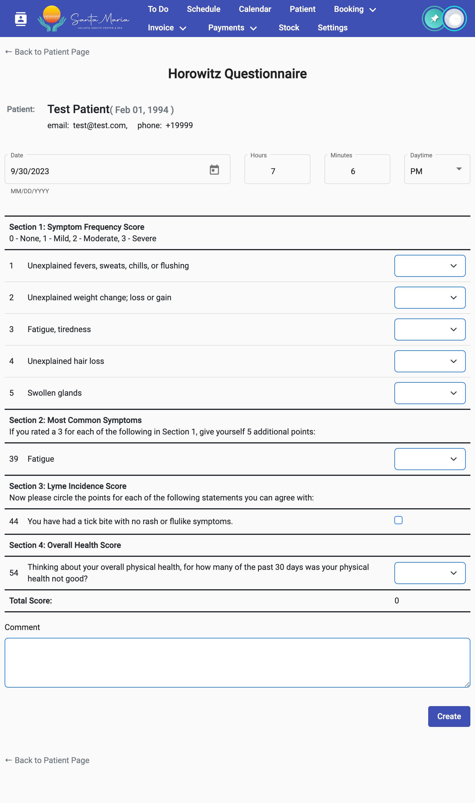

# Опросы

Опросы делятся на два типа:

* рекламные опросы — опросы, которые проходит пациент самостоятельно без авторизации в личном кабинете. В данном случае, опрос "привязывается" к пациенту по email. Если в системе email пользователя указан неверно, или указан для нескольких клиентов, опрос может быть привязан к неправильному клиенту. **Данные опросы нельзя отменить или изменить.**
* общие опросы, заполняемые доктором самостоятельно из системы Дашборд.

Раздел Опросов на странице пациента выглядит следующим образом:

<figure><figcaption></figcaption></figure>

На изображении:

* В правом верхнем углу расположена кнопка "Обновить информацию на странице". Если после открытия данного раздела у пациента появились новые опросы, после нажатия на кнопку они появятся.
* Ниже расположена кнопка "Добавить опросник Horowitz".
* Далее идёт список опросников пациента: сначала расположены карточки с результатами опросов, заполненных врачом, затем рекламные опросы.

Карточки с результатами проведения разных опросов отличаются.

Страница создания/редактирования опроса, созданного врачом в системе Дашборд, будет выглядеть следующим образом:

<figure><figcaption></figcaption></figure>
